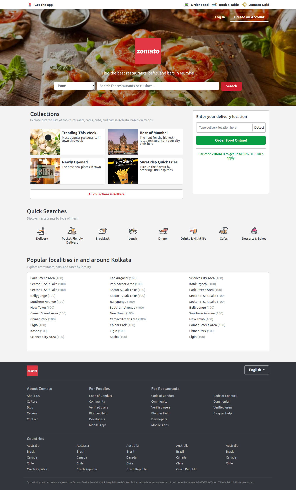

# Zomato Landing Page Replica

## Description
Zomato Landing page replica created with HTML and SCSS, fully responsive page. Created for a for an assignment in Sprint 2 of Frontend Web Development Career Track Course by GreyAtom.

## Technologies Used
1. HTML
1. SCSS
1. Node-SASS

[Live Preview](https://shubhambattoo.github.io/ark-studio/)

